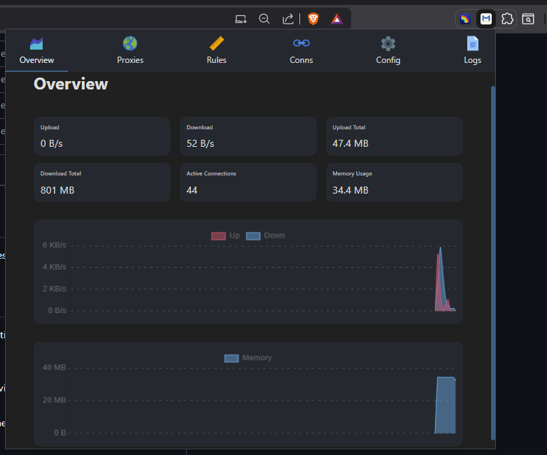

# Yacd | XC-UI - Chrome Extension

A Chrome extension version of **Yet Another Clash Dashboard** (Yacd) that provides a convenient browser-based interface for managing Clash proxy clients.

## 📸 Screenshot



*The Yacd dashboard running as a Chrome extension with real-time traffic monitoring and proxy management interface.*

## 🚀 Features

- **Dashboard Interface**: Clean, modern UI for managing Clash proxy configurations
- **Real-time Monitoring**: Live traffic statistics and connection monitoring
- **Proxy Management**: Configure and switch between different proxy servers
- **Connection Logs**: View detailed logs of network connections and proxy activities
- **Rules Management**: Manage proxy rules and routing configurations
- **Multi-language Support**: Available in English, Chinese (Simplified), and Chinese (Traditional)
- **Responsive Design**: Optimized for browser extension popup (900x700px)

## 📦 Installation

### From Source
1. Clone or download this repository
2. Open Chrome and navigate to `chrome://extensions/`
3. Enable "Developer mode" in the top right corner
4. Click "Load unpacked" and select the `dist` folder
5. The extension will be installed and ready to use

### From Chrome Web Store
*(If published to Chrome Web Store, add link here)*

## 🛠️ Usage

1. **Setup**: After installation, click the extension icon in your browser toolbar
2. **Configuration**: Configure your Clash server endpoint (default: `http://127.0.0.1:9090`)
3. **Dashboard**: Access the main dashboard to monitor traffic and connections
4. **Proxy Management**: Switch between different proxy configurations
5. **Logs**: View real-time logs of network activities

## 🔧 Configuration

The extension connects to your local Clash client by default. Common configurations:

- **Default Backend**: `http://127.0.0.1:9090`
- **Alternative**: `http://localhost:9090`
- **Custom**: Configure your own Clash server endpoint

## 📁 Project Structure

```
dist/
├── manifest.json          # Extension manifest
├── popup.html            # Main popup interface
├── popup.js              # Main application logic
├── popup.css             # Extension-specific styles
├── background.js         # Background service worker
├── assets/               # Icons and images
├── *.js                  # Component modules
└── *.css                 # Stylesheets
```

## 🌐 Supported Languages

- English (`en.js`)
- Chinese Simplified (`zh-cn.js`)
- Chinese Traditional (`zh-tw.js`)

## 🔒 Permissions

The extension requires the following permissions:
- `storage`: Save user preferences and configuration
- `activeTab`: Access active tab for proxy management
- `scripting`: Inject scripts for functionality
- `host_permissions`: Connect to Clash servers (localhost and custom endpoints)

## 🎨 UI Components

- **Sidebar Navigation**: Quick access to different sections
- **Traffic Monitor**: Real-time bandwidth usage charts
- **Connection Manager**: Active connections overview
- **Rules Engine**: Proxy routing rules configuration
- **Logs Viewer**: Detailed connection logs with filtering

## 🔧 Development

### Prerequisites
- Node.js (for development tools)
- Chrome browser
- Local Clash client running

### Building
The `dist` folder contains the production-ready extension files. For development:

1. Make changes to source files
2. Test in Chrome by reloading the extension
3. Use Chrome DevTools for debugging

### File Overview
- `popup.js`: Main React application bundle
- `Config.js`: Configuration management
- `Connections.js`: Connection monitoring
- `Logs.js`: Log viewing functionality
- `Proxies.js`: Proxy server management
- `Rules.js`: Routing rules management

## 📊 Features Detail

### Traffic Monitoring
- Real-time upload/download statistics
- Historical traffic charts
- Connection speed indicators

### Proxy Management
- Multiple proxy server support
- Quick switching between configurations
- Health check indicators

### Connection Logs
- Real-time connection logging
- Filterable log entries
- Export functionality

### Rules Engine
- Custom routing rules
- Domain-based routing
- IP-based routing
- Regular expression support

## 🐛 Troubleshooting

### Common Issues

1. **Extension not connecting to Clash**
   - Ensure Clash is running on the configured port
   - Check if external controller is enabled in Clash config
   - Verify the server endpoint URL

2. **Popup not loading**
   - Check browser console for errors
   - Ensure all required permissions are granted
   - Try reloading the extension

3. **Features not working**
   - Verify Clash API compatibility
   - Check network connectivity
   - Review extension permissions


## 🤝 Contributing

1. Fork the repository
2. Create a feature branch
3. Make your changes
4. Test thoroughly
5. Submit a pull request

---

**Note**: This extension requires a running Clash client to function properly. Make sure your Clash configuration allows external controller access. 